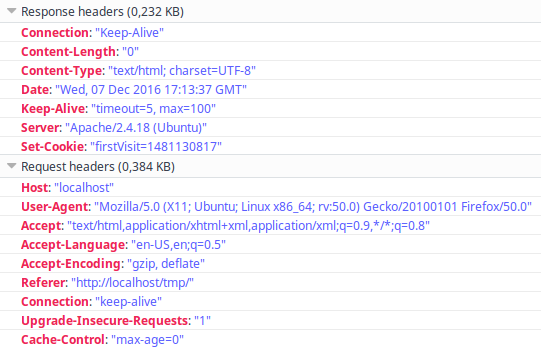

* TOC
{:toc}

HTTP protocol was designed stateless, the cost for this simplicity is inability to maintain any kind
of information between subsequent HTTP requests from particular client on server's side. The server simply does
not know, whether it has talked to certain client before or not. Yet you know, from your own experience,
that this is possible.

You used a server-side storage called *session* in walkthrough article about [authentication](/en/apv/walkthrough/login)
of users. Let's take a step back and think about how to allow server identify its clients.

## Make HTTP stateful
From server's point of view, you may have thousands of HTTP connections from hundreds of clients at a time.
What means can be used to logically connect HTTP requests? How can the server tell that some set of connections
came from certain client? We need to distinguish clients somehow -- we need some unique information
about each client to tell who is who.

{: .note}
What does it even mean to "logically connect HTTP request"? It simply means, that a server can use some
provided information about the client which a server (or your application) **decides to believe**.

What can you use as unique identifier? You have these options:

- an IP address -- problems are non-static IP addresses and firewalls with many clients behind them. This
  means that one IP can represent many actual machines/users.
- a GET and/or POST parameter -- this can be done, but it is a lot of work for web developer.
- some other piece of information supplied by a client -- this is actually used and it is called a *cookie*.

You can supply some unique key to the server using a *cookie* which is compared to some kind of server
storage (database or file with all user keys). The server can then tell one client from another.

{: .note}
Users with disabled cookies have to rely on GET/POST parameter. You can give your application an ability
to attach client identifier to **all links** and add it as hidden input to **all forms**. This would be used
as first response to all users (everybody will see session ID parameter in all generated URLs of first response
from your server). If a cookie is successfully set (and returned in second HTTP request), backend stops to
attach client identifier parameter to links and forms. This is a **lot** of work (you also have to handle
search engine crawlers -- they do not support cookies and you do not want your page to be indexed with some
cryptic URL parameters).

## Cookies
A cookie is a general purpose **client** side storage. You can store short strings under a named identifier.
You might be asking how a client-side storage is helpful to maintain state of application on a server?
I already told you -- server decides to believe information from a client, that is all you have. The client
is used to store its own state for server (or at least part of it).

This is not quiet safe, because anyone (user or software) can access and modify cookie files created by a
browser. Therefore it is wise to store only a key to identify user data repository on server (read on).

A **bad** usage of cookie is to set ID or login of a user which is logged on. Anybody can change this
information and pretend that he is somebody else. Saving a password into a cookie is also bad because
it can be stolen by computer viruses.

### Setting up a cookie and reading it
A cookie is delivered to the client with HTTP headers of server's response. Visitor's internet browser
stores the cookie in its cache and starts to send it in HTTP headers of its requests. It means that values
stored in cookies can be accessed by server in following HTTP requests.

Following example stores a cookie with timestamp of first visit. PHP uses superglobal `$_COOKIE` array
to **read** cookies data and a `setcookie()` function to set them.

File `cookie-set.php`:





File `cookie-read.php`:





Following images shows headers of HTTP request/response with *Set-Cookie* header in response
and *Cookie* header in subsequent request:

First visit to `cookie-set.php` script:

Visit to `cookie-read.php` script:

{: .note}
Function `setcookie()` must be called **before any other output** (`echo`s and `print`s). It is same as
general `header()` function because HTTP headers cannot be sent after HTTP body starts to be transmitted.
You can also use `header()` function to set a cookie manually, but it is more complicated.

### Security
Cookies can be stolen or modified by a user or by malicious software. TODO

### Cookie parameters
A cookie can have many parameters, most important one is duration which tells browser how long to store a
cookie. Default behaviour is to delete cookies right after browse's window is closed. You can check out
[`setcookie()` function](http://php.net/manual/en/function.setcookie.php) in of PHP manual.
You can set cookie to be stored on client's drive for many days but you should not rely on it.

{: .note}
To remove cookies manually in your browser use Ctrl+Shift+Del hotkey and select deletion of cookies in
desired period of time.

## Sessions
The session uses client's cookie storage to save a key (*session ID*) which is used to identify one particular
repository of client related data on a server. This is much safer because data in session can only be modified
by application's code. Still you have to believe that session ID which is supplied by a random client belongs
to him.

PHP uses function [`session_start()`]() to initiate session. This function takes a look if a client supplied
session ID using a cookie and fills special variable `$_SESSION` with data stored under session ID key.
If there was no session ID cookie in HTTP request headers, the PHP generates one, establishes new storage
space under that key and sends that key to client via HTTP headers. Associative array `$_SESSION` can be used
both to read and write data into server's session repository.

{: .note}
Session mechanism is an extension of cookies and you do not have to use it. You can also implement
very similar functionality by yourself. If you use JavaScript frontend framework, you can send custom
HTTP headers with every request to identify a client -- sessions are not recommended in [REST](https://en.wikipedia.org/wiki/Representational_state_transfer).
You can also use another kind of client-side storage with JavaScript called [local storage](https://developer.mozilla.org/cs/docs/Web/API/Window/localStorage).

{: .note}
PHP stores session data in temporal files. If server's security is compromised somehow, session data
can be accessed by an attacker (this can happen on shared web hosting servers). You can set your own
session handling functions in PHP to store sessions in a database.
Another gotcha of shared hosting is situation when server's disk drive is full and PHP cannot store
cookie data into a file leading to a situation of inability to login for all users.

### Session cookie parameters
Almost the same as cookie but can be set up by another function. TODO

## What to store in session or cookie?
A visitor can have multiple tabs or windows with your web application opened at once. Therefore it is not a
good idea to store values which can vary between those instances (e.g. search query or page number). You
have to carefully select what to store in session and what to pass as request parameter.

## Summary
Now you know more details about cookies and sessions. These instruments are essential for website
developers as they allow you to store state of your application. Sometimes you will encounter users who
had disabled storage of cookies in their browsers on purpose and your application will not run in their
browser.

Modern approaches to web application development (RIA and SPA) can be realised without cookies or sessions
because state of application can be stored much more comfortably on client side. Traditional approach
requires both server and client to do their part.

### New Concepts and Terms
- cookies
- session
