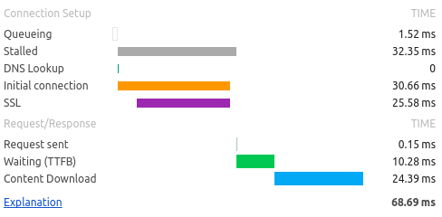

<section markdown='1'>
## Web Applications - technical aspects
- Single page is composed from many small components
    - Main HTML file
    - CSS files
    - Files with JavaScript code
    - Multimedia (images, video...)
    - Embedded components (i.g. maps, like/share buttons)
- Sometimes stored on multiple servers -- load speed is crucial to keep visitor interested
    - Maximal amount of connections per host
    - Speed of connection and latency
</section>

<section markdown='1'>
### Visitors' point of view

</section>

<section markdown='1'>
### HTTP point of view

</section>

<section markdown='1'>
### Anatomy of HTTP request

</section>

<section markdown='1'>
## Web Applications - sandboxed network application
- There are things that you cannot influence
    - Speed and quality of connection
    - Execution environment (browser)

| Download from mendelu.cz        | Download from nasa.org    |
|  |  |

</section>

<section markdown='1'>
## Metadata
- Content related
    - Charset
    - Cache control
    - Zoom behaviour for mobile devices
- Search engine crawlers
    - Keywords
    - Description
    - Author
    - Only a small impact for SEO
    - Not that important for web applications
</section>

<section markdown='1'>
## Cache
- First visit to a website -- browser downloads everything
    - Many files are *static* (files that never change)
    - Next visit -- download only modified files
- Cache types
    - Local -- in your computer (RAM or HDD)
    - Shared -- for whole organisation/town
- Good for performance
- Problems with dynamic content (login/logout, commercials...)
</section>

<section markdown='1'>
## HTTP Cache management
- Uses HTTP headers
- Set maximal time to store cached content on client
    - for defined period of time
- Type of content -- private X public
- Client must check for changes
    - By last date of content change
    - By content hash

| First-time transfer               | Subsequent transfers            |
|  |  |

</section>

<section markdown='1'>
## Cache control

#### By last modification

    Server:
    Last-Modified: Wed, 13 Oct 2004 09:43:02 GMT
    
    Client:
    If-Modified-Since: Wed, 13 Oct 2004 09:43:02 GMT

#### By content

    Server:
    ETag: "3fe48-527f-52237c0"
    
    Client:
    If-None-Match: "3fe48-527f-52237c0"

</section>

<section markdown='1'>
## Web Applications - state management
- Authentication, forms, shopping cart...
- HTTP is *stateless*
    - Server cannot logically connect individual requests
    - One page-view is made of many HTTP requests
    - Multiple clients request data from server in the same time
- Tracking state is problematic
    - IP address
    - GET/POST parameters
    - Cookies
    - Session
</section>

<section markdown='1'>
## Web Applications - state management
- IP address
    - one IP may be shared by many machines/users
    - IP 6 still not widely available

</section>

<section markdown='1'>
## State - GET/POST parameter
- GET/POST parameters
    - dangerous for users
    - tedious for programmers

    <a href="...&userIdentity=abc123">...</a>


    <form action="..." method="post">
        <input type="hidden" name="userIdentity" value="abc123" />
        ...
        <input type="submit" value="..." />
    </form>

</section>

<section markdown='1'>
## State - Cookies
- State is stored in browser
    - Unreliable - user or software may delete/modify
    - Insecure - not encrypted, anybody can access cookies
- Cookies have limited lifespan
    - until browser is closed (only in RAM)
    - given duration (stored on disk)
- Cookies are automatically attached to every request
- Cookies are attached to a domain that requested to store data in them
- Cookies can store only texts (max 4KiB), transferred along each HTTP request
</section>

<section markdown='1'>
## State - Cookies

#### First client request

    GET / HTTP/1.1
    Host: mendelu.cz
    ... + empty line

#### Response from server

    HTTP/1.1 200 OK
    Set-Cookie: name=value
    ... + empty line
    <!DOCTYPE html>
    ...
    
#### Subsequent client requests

    GET / HTTP/1.1
    Host: mendelu.cz
    Cookie: name=value
    ... + empty line

</section>

<section markdown='1'>
## State - Session
- State is stored on server
- Large amount of data can be stored
- Automatic sessions:
    - An identification code is generated with first request and send in response to a client
    - Data is stored under that identifier **on server**
    - Client stores this identifier into cookie and sends it with subsequent requests
- Server needs to match client with stored content
    - Only session identifier is transferred
    - Session identifier is weak spot - session hijacking
</section>

<section markdown='1'>
## Session 1

</section>

<section markdown='1'>
## Session 2

</section>

<section markdown='1'>
## Session 3

</section>

<section markdown='1'>
## Session - more clients

</section>

<section markdown='1'>
## Checkpoint
- Does state management based on session require to use cookies?
- Can a HTML form be submitted using GET method?
- Can you store session data in a database?
- How many HTTP requests can be processed between a client and a server at once?
- Can you send an HTTP POST request without HTML form?
</section>