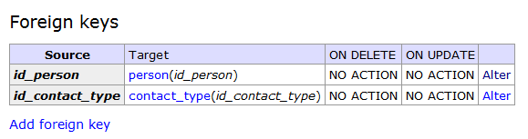

* TOC
{:toc}

This section is dedicated to teach you how to delete database entries.
Deleting something from database is permanent and cannot be undone unless you have a database
backup. Be careful about what you delete.

The [SQL `DELETE`](/en/apv/walkthrough/database/#delete) command is already familiar to you.
One thing you should think of is how to determine which rows to delete. Most common action
is deletion of a single row. Each table should have a 
[primary key](/en/apv/articles/relational-database/#key) which identifies
each row with unique value or set of values. You should therefore use it to delete rows.

Be especially careful about compound keys. You cannot delete a single person record by entering
its `first_name` and `last_name` values, because these two properties
of a person can be shared among many records in database (there is unique key on `first_name`,
`lastname` and `nickname` columns). Such way of deleting records can have unwanted side effects.

Before you allow users of your application to modify or even delete information, you should first
take steps to [authenticate](/en/apv/walkthrough/login) and authorize them.

## Getting started
We will create a PHP script which will handle deletion of a person when we supply suitable
parameter. This parameter should be primary key of a row you want to delete -- only one number.

We can create simple form with `<input type="number">` to test this function and a small backend
script which will execute `DELETE` SQL query.

Latte template with form:





PHP script with `DELETE` SQL command:





### Redirect After POST
If you submit the above form and reload the page (hit F5), you will receive a message from web browser
similar to this:

In the form, we used `method="post"` which means that the form is submitted using [HTTP POST method](todo).
The HTTP POST method should be used to represent user actions (e.g. deleting a person). Reloading the 
page will send the same HTTP request -- i.e. it will repeat the action, which is what the browser
is asking about. To avoid this annoyance, you have to **redirect after POST**: 





In the above script, I added the line `header("Location: delete.php");`. This calls the PHP
[`header()` function](http://php.net/manual/en/function.header.php) which sends a [HTTP header](todo).
The [`Location` header](https://en.wikipedia.org/wiki/HTTP_location) is used to inform the browser
that the page has moved (redirected) to a new location. In this case, the new location is the same as the old location
(`delete.php`), but the browser still moves to the new address. During this the POST data from the 
form are lost, because HTTP GET method is used. This means that when the user actualy sees the page, 
the browser will be looking at the second load of that page and it will know nothing about the submitted form.

The schematic below ilustrates this in a sequence of steps:

{: .image-popup}

This 'trick' should be used for all forms representing actions (submitted with POST method), including
insert and update forms.

### Task -- Make a delete button
The above script works but it is not very useful. Users of your application do not understand primary keys
and they do not want to remember some ID value which they have to type into a form. They want to see
list of persons and a nice delete button which they just click.

Extend your script which [lists all persons](/en/apv/walkthrough/backend-select/) with a delete button. Change that `<input type="number">`
we used in previous example to `type="hidden"` and put this form in every row of users list.
Pass value of `id_person` in that hidden field. Remember to extend `SELECT` SQL command to
retrieve `id_person`.

{: .solution}




## Next Steps
Take a look at [JavaScript](/en/apv/walkthrough/javascript#using-javascript-to-confirm-user-actions)
article to extend your form with confirmation popup. It is a good idea to let user confirm deletion of
important information first because this action cannot be undone.

### Deleting records which are referenced by other records
There are [foreign keys](/en/apv/articles/database-tech/#foreign-key-constraint) between `person` table
and other tables (`person` table is referenced from records in `relation` or `contact` tables). When you take a look
at *Foreign keys* section of `contact` table details in Adminer, you can see that there is `NO ACTION` defined under
`ON DELETE` event:

 
This means that if you try to delete a person record, the database server has no defined action to do with contacts
related to it -- the database does not know what to do with person's contacts when that person record ceases to exist.
Due to foreign key constraint, `id_person` column in `contact` table cannot store anything else than values from
`id_person` column in `person` table. As a result, the database has to reject your `DELETE` command.

Of course, it is not meaningful to keep contact entries which do not belong to any person. We should therefore set
that `ON DELETE` behaviour to `CASCADE` (use "Alter" button on right side):

You should change this in every table which references `person` table, otherwise you won't be able
to delete persons with related entries in those tables.

In other cases you might prefer to break relation instead of deleting related entries. It is the case 
of [`location` -- `person` relationship](/en/apv/articles/database-tech/#foreign-key----set-nul-example). 
When you want to delete an address which is referenced by a person record, you would rather set `id_location` column
in `person` table foreign key deletion behaviour to `SET NULL` instead of `CASCADE`. Such setting would preserve
a person record and set its `id_location` column to NULL (from now on, you will not know where he lives anymore).
To be able to do this, `id_location` column must support storing NULL value.

### Task -- Configure Foreign Keys
Now configure the foreign keys in your database so that you can delete records as needed.

{: .solution}

If you are stuck, I suggest you configure the following tables and keys:

- table `contact`, key `contact_id_person_fkey` set to `CASCADE`
- table `meeting`, key `meeting_id_location_fkey` set to `SET NULL`
- table `person`, key `person_id_location_fkey` set to `SET NULL`
- table `person_meeting`, key `person_meeting_id_meeting_fkey` set to `CASCADE`
- table `person_meeting`, key `person_meeting_id_person_fkey` set to `CASCADE`
- table `relation`, key `relation_id_person1_fkey` set to `CASCADE`
- table `relation`, key `relation_id_person2_fkey` set to `CASCADE` 

## Summary
You now know how to delete records from a database. You should understand how foreign keys guard the
consistency of the data and that you need to think what to do with the dependent records -- whether to delete them along
or leave them in database while removing link to deleted record. For a deeper explanation see
the [corresponding article](/en/apv/article/database-tech/#integrity-constraints). You can also
take a look at chapter about [login](/en/apv/walkthrough/login) to limit access to this functionality.

### New Concepts and Terms
- Delete
- Foreign keys
- Redirect
