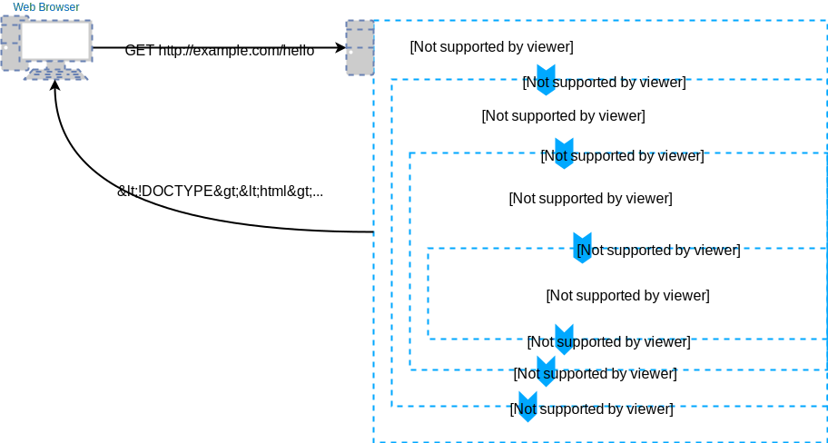

* TOC
{:toc}

In the [previous chapter](../html-forms/), you have learned how to set up an application 
using the [Slim Framework](,,/slim-intro/#getting-started). You should know 
what [Composer](../slim-intro/#composer) is. You should understand the basic 
Slim [project structure](../slim-intro/#project-structure), how to set up database credentials and 
where the application log is. In this part of the walkthrough I will show how to actually do something.

The main piece of code where you want to works is located in the `routes.php` file in the `src` directory.
The file already contains some code so that your application 
[can be tested](../slim-intro/#running). Instead of
explaining what the code does I want you to directly start editing it and I'll explain along
the way. Before you do any modifications, do check that your application [works](../slim-intro/#running).

## Adding a New Route
The `routes.php` file contains (as the name suggests **routes**). A *route* is a combination
of a [HTTP method](/articles/web/#http-protocol) and an [URL](/articles/web/#internet-addressing). 
For example `GET http://example.com/my-list/` is a route. 
Because most applications are independent on the domain they run on, the route in the application 
is written as `GET /my-list/`. If the application **handles** the route, it means that
it recognizes the router and it shows something to the end-user. Otherwise the URL does not exist and the
end-user will see a 404 Not Found error.

The `routes.php` file contains all the routes your application handles. Let's look at a simple
route:

~~~ php?start_inline=1
$app->get('/hello', function (Request $request, Response $response, $args) {
    echo "Hello World!";
});
~~~

Go ahead and add this piece of code at the end of your `routes.php` file. Upload the changed file to
the server (if necessary) and visit the `/hello` URL. You should see a "Hello World!" message in your
browser. 

The `$app` variable contains the 
[Slim Application](https://www.slimframework.com/docs/v3/objects/application.html) object. The 
variable is already initialized elsewhere (in `public/index.php` file) so it is ready to use.
The Application has a method `get` (and also `post`, `put` and other [HTTP verbs](/articles/web/#http-protocol)) 
which configures a route. The method 
[accepts two parameters](https://www.slimframework.com/docs/v3/objects/router.html#how-to-create-routes).
The first is the name of the route and the second is the a function which handles the 
route --- a **callback** (or **handler**) (something that is *called back* when 
a request to that particular route is made).
Because the above code may still look a little bit messy, let's separate it:

The call to the `get` function is:

~~~ php?start_inline=1
$app->get('/hello', callback);
~~~

And the callback definition is:

~~~ php?start_inline=1
function (Request $request, Response $response, $args) {
    echo "Hello World!";
}
~~~

{: .note}
The last line of the original function `});` is particularly confusing because `}` 
belongs to the handler, and `);` belongs to the `$app->get` call.

If you read the introduction about [functions](../backend-intro/objects/#functions), 
you may still be missing the 
name of the function. This is correct, because the callback --- as we used it in the
`routes.php` file --- was defined as an **anonymous function**. To write the equivalent code
without using an anonymous function you would have to name it somehow:

~~~ php?start_inline=1
function handleGetHello (Request $request, Response $response, $args) {
    echo "Hello World!";
}

$app->get('/hello', 'handleGetHello');
~~~

{: .note}
There function `handleGetHello` in the `$app->get` line is passed as a string. If you write 
`handleGetHello()`, you immediatelly call the function. However, in this case we want to call 
the function only when something happens (i.e when a particular HTTP request is encountered). 
So we only tell the `$app->get` function what function it should call when it needs to.

The above code is also acceptable, but is unnecessarily verbose, because the function
`handleGetHello` will ever be used only in one place. Therefore the very first piece of
code is used much more often.

### Request and Response
In the above simple request handler, you don't have to worry about the
 `Request $request, Response $response, $args` stuff in the handler. Now let's see what 
 it is good for. Every request handler (regardless of the URL and HTTP method) has the
 same [*signature*](todo):

~~~ php?start_inline=1
function (Request $request, Response $response, $args) {}
~~~

This means that the handler takes 
[three parameters](https://www.slimframework.com/docs/v3/objects/router.html#route-callbacks):

- an object representing the HTTP request (generated automatically by the Slim framework)
- an object representing the HTTP response (empty and expected to be filled by the handler)
- a list of values for [route placeholders](todo)

The notation `Request $request` means that the argument `$request` is of type `Request`. 
This is called a 
[type declaration](http://php.net/manual/en/functions.arguments.php#functions.arguments.type-declaration) 
(or type hint) in PHP. The `Request` class actually refers to the
`\Psr\Http\Message\ServerRequestInterface` class. This is done in the very beginning of the 
`routes.php` file by the line `use \Psr\Http\Message\ServerRequestInterface as Request;`. The 
`\Psr\Http\Message\ServerRequestInterface` class is part of 
[PHP specification](http://www.php-fig.org/psr/psr-7/). This means that they are not specific for the
Slim framework and you'll likely encounter them in future (if you keep using PHP).

This probably sounds quite complicated. But there are few important points to understand:

- The route handler has access to everything sent in the HTTP request in some object in the `$request` variable.
- The route handler is expected to write the result in the HTTP response represented by some object in the `$response` variable.

{: .note}
In the first example, I didn't use the `$response` object, and instead I used `echo` directly to write 
to the output. Yes, that is a shortcut, which is possible too.

### How does it work?
You probably feel that there is a lot of magic. How does it happen that when the end-user visits
some URL, your route callback gets executed? 

When an end-user visits a page in the web browser, the web browser generates an 
[HTTP request](todo) and sends it to the web server. The server receives it and processes it.
This is the point where `.htaccess` and [mod rewrite](todo) kicks in. This causes that the 
`index.php` script is executed regardless of what path was specified in the request. Once
the `index.php` script is running, it starts the Slim Framework application (initializes the `$app`).
It analyzes the HTTP request and picks the most important parts for your application --- the 
*method* and the *path*. Then it looks in the list of registered routes `routes.php` file to see if 
the method and path match some known route.

If they do, the Slim Framework creates a `Request` object with the representation of the HTTP
request and an empty `Response` object. Then it executes the handler associated with the 
matching route and passes it the `$request` and `$response` variables. The handler runs your code
and returns (or '`echo`es') the modified `$response` object. The Slim Framework takes it, and 
generates an HTTP response and passes it to the web server. The web server then replies to the
end-user's browser with this response. 

The end-user is looking at blank page while all this 
is happening (though it shouldn't take more than a few milliseconds). When the web browser
receives the response, it processes the HTML code and [renders](/articles/css/) the page on the 
end-user's screen.

{: .image-popup}

## Working With the Request
Working with request and response objects is important when you need to get some data from the end-user. 

### Task -- Create a Simple Form
Now create another route, name it e.g. `/enter-name` and make sure it outputs a simple
[HTML Form](../html-forms/) with a text field and a button.

{: .solution}
~~~ php?start_inline=1
$app->get('/enter-name', function (Request $request, Response $response, $args) {
    echo "
    <!DOCTYPE html>
    <html>
        <head>
            <meta charset='utf-8'>
            <title>Enter Name</title>
        </head>
        <body>
            <form method='post'>
                <input type='text' name='name'>
                <button type='submit' name='save'>Send</button>
            </form>
        </body>
    </html>";
});
~~~

Note that the part `method='post'` is important for the next bit.
Now if you visit the URL `/enter-name` in the web browser, you should see the form. 
Fill it in and click the button. You should see an error:

    Method not allowed. Must be one of: GET, GET

This means exactly what it says. Your application was able to recognize the URL
and find a matching route, but that route does not allow the particular 
[HTTP method](todo) you used in the request --- the *POST* method (as specified in
`method='post` in the `<form>` field). This is expected, because we used
`$app->get('/enter-name', ...` in our route.

### Task -- Add a POST Handler
The solution is to add another route for the same URL but for the `post` method. This route
will handle the HTTP request created when the form is submitted. Use the following
code as the *body* of the handler:

~~~ php?start_inline=1
$input = $request->getParsedBody();
echo "The end-user entered name:" . $input['name'];
~~~

{: .solution}
~~~ php?start_inline=1
$app->post('/enter-name', function (Request $request, Response $response, $args) {
    $input = $request->getParsedBody();
    echo "The end-user entered name:" . $input['name'];
});
~~~

Now when you fill and send the form, you should see the respective message.
The secret weapon to work with values from HTML forms is the `$request->getParsedBody()` method.
It processes the form data and returns them as an 
[associative array](../backend-intro/array/) indexed by the 
[form control name](../html-forms/#name-and-value).

## Working With Response
As shown above, to create the application response, it is sufficient to
`echo` the result. However, this is approach is quite simplistic and is not
suitable for more complex responses.

### Task -- Generate an HTML Response
In the [above example](#task----add-a-post-handler), the route handler returned only 
a plain text response. Even if the web browser is capable of displaying it, it is 
not a valid HTML page. Go ahead and extend the
`post` handler to return a valid HTML page. Display the user-provided value both 
in the page title and in the page body, make it `<strong>` in the page body.

{: .solution}
~~~ php?start_inline=1
$app->post('/enter-name', function (Request $request, Response $response, $args) {
    $input = $request->getParsedBody();
    echo "
    <!DOCTYPE html>
    <html>
        <head>
            <meta charset='utf-8'>
            <title>" . $input['name'] . "</title>
        </head>
        <body>
            
The end-user entered name: <strong>" . $input['name'] . "</strong>

        </body>
    </html>";
});
~~~

Another solution is possible using the `response->getBody()->write()` function to
avoid concatenating the strings, e.g. like this:

{: .solution}
~~~ php?start_inline=1
$app->post('/enter-name', function (Request $request, Response $response, $args) {
    $input = $request->getParsedBody();
    $response->getBody()->write("<!DOCTYPE html>
    <html>
        <head>
            <meta charset='utf-8'>
            <title>");
    $response->getBody()->write($input['name']);
    $response->getBody()->write("</title>
        </head>
        <body>
            
The end-user entered name: <strong>");
    $response->getBody()->write($input['name']);
    $response->getBody()->write("</strong>

        </body>
    </html>");
    return $response;
});
~~~

Both solutions produce exactly the same output. You may like the first or second, but
I find them both ugly. Apart from that, they are both wrong, because they are 
**insecure**. This approach to generating a HTML response is prone to 
[XSS attacks](/articles/security/xss) and should really be avoided. The right solution to this
is to use [templates](../templates/). Using the `$response` object is also 
necessary when you need to manipulate [HTTP headers](todo).

## Summary
In this part of the walkthrough I have explained how routes work in the Slim Framework. Although
I have described the details of implementation in this specific framework, the concept of 
routes and their handlers is common to almost all PHP frameworks (and most web application 
frameworks in other languages too). 

You should now be able to define your own routes, generate simple HTML pages and process
values from simple forms. You should also have a basic understanding how an HTTP request 
is processed and a response to the end-user is generated.

### New Concepts and Terms
- Slim Framework
- Routes
- Callback/Handler
- Anonymous Function
- Request
- Response
